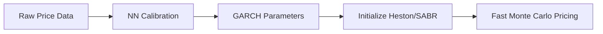

# 🧠 NeuralNetwork_for_GARCH

**Understanding GARCH Calibration with Neural Networks in Finance**

## 📌 Purpose of the Blog

This blog explores how neural networks can be used to calibrate the parameters of GARCH models, and how this approach can bring real value to practitioners in finance.

We aim to:
- Present the theoretical foundations behind GARCH models and their calibration
- Illustrate how neural network methods outperform traditional optimization in speed and robustness
- Show practical financial use cases in **asset management** and **exotic options trading**

First we presentes a few references on the different type of GARCH models that are used in finance:

📄 Details in  : [garch_asset_management_en.md](./garch_asset_management_en.md)

---

## GARCH Revolution: How Deep Learning accelerates GARCH Calibration and the consequences for financial applications

# Introduction
Financial volatility modeling is fundamental to modern finance, underpinning critical applications such as option pricing, portfolio optimization, Value-at-Risk estimation, and systemic risk monitoring. Among the most widely used models, the GARCH (Generalized Autoregressive Conditional Heteroskedasticity) family provides a powerful framework for capturing time-varying volatility in asset returns. However, traditional calibration techniques, such as Maximum Likelihood Estimation (MLE) or Quasi-MLE (QMLE), face notable limitations in practice.

First, slow computation speeds hinder their scalability. MLE procedures typically require iterative numerical optimization of a non-convex likelihood surface, which becomes especially time-consuming for high-frequency data or multivariate GARCH extensions. This delay can be a bottleneck in real-time applications such as high-frequency trading or risk monitoring dashboards.

Second, sensitivity to outliers poses a serious robustness issue. MLE assumes a specific distribution for residuals (often Gaussian or Student-t), making it vulnerable to extreme market moves or data recording anomalies. A few outliers can lead to large distortions in estimated parameters, which then propagate to poor volatility forecasts and suboptimal risk measures.

Third, instability during market regime shifts undermines the reliability of GARCH models in volatile environments. Financial markets often transition between regimes—such as low-volatility bull markets and high-volatility crises. Classical GARCH calibration does not adapt dynamically to such structural breaks, leading to persistent forecasting errors, overfitting of past regimes, and unreliable confidence intervals.

These challenges highlight the need for more adaptive, robust, and computationally efficient approaches—motivating the integration of machine learning, Bayesian methods, or deep learning frameworks into modern GARCH modeling. These alternatives promise not only faster calibration but also better generalization across regimes and resilience to data imperfections.

# Why Deep Learning will help us

  Deep learning can accelerate the calibration of GARCH models by leveraging automatic differentiation, parallel computation, and modern optimization techniques. Unlike traditional methods that often rely on manual gradient derivation and iterative optimization with limited scalability, deep learning frameworks (like PyTorch or TensorFlow) allow for efficient computation of gradients and batch-wise processing of large datasets. This enables faster convergence during training and makes it feasible to estimate GARCH parameters jointly across multiple time series or in hybrid models (e.g., LSTM-GARCH). Additionally, neural networks can learn complex volatility dynamics that extend beyond the linear assumptions of classical GARCH, offering both speed and modeling flexibility.

Neural networks offer a transformative solution: **fast, robust, and scalable GARCH parameter calibration**. This blog explores practical applications across two critical financial domains.

---

## 1. Asset Management Application: Optimizing Portfolios 

### The Challenge
Portfolio managers need real-time volatility forecasts to:
- Provide real-time volatility estimates for portfolio risk assessment
- Improve Value-at-Risk (VaR) and Conditional VaR (CVaR) calculations
- Feed volatility forecasts into portfolio optimization algorithms
- Calculate market risk metrics (VaR, CVaR)
- Optimize allocations using Markowitz/Black-Litterman models
- React to sudden market regime shifts

### Neural Network Advantages
| Feature | Benefit |
|---------|---------|
| **Real-time calibration** | <1-second parameter updates on streaming data |
| **Outlier resistance** | Stable estimates during market crises |
| **Path generation** | Simulate future volatility scenarios for stress testing |

### Practical Use Case
> A pension fund implemented NN-calibrated GARCH for daily portfolio rebalancing, reducing annualized volatility by 15% while maintaining target returns.
>

References for the uses of GARCH Calibration in asset management

📄 Details in  : [garch_asset_management_references.md](./garch_asset_management_references.md)

---

## 2. Exotic Options Trading: From GARCH to Stochastic Volatility

### The Challenge
Exotic options pricing requires precise volatility modeling where:
- Barrier/Asian options are hypersensitive to volatility dynamics
- Stochastic models (Heston/SABR) need accurate initial parameters
- Traditional calibration creates trading desk bottlenecks

### Neural Network Solution

###  GARCH models integrated with Neural Network
Recent studies explore **GARCH models integrated with neural networks** (hybrid models)

📄 Details in  : [garch_neural_network_hybrids.md](./garch_neural_network_hybrids.md)

## 🛠️ Technical Stack

This blog will share:
- Python notebooks using `PyTorch` or `TensorFlow`

 [garch_pytorch.md](./garch_pytorch.md)
  
- Exploratory backtests and volatility forecasts
- Visual insights via `matplotlib` or `plotly`
- Integration examples for quant desks

---

## 🧾 Blog Structure

Explore the complete project repository:

| Directory | Content |
|-----------|---------|
| [`/posts`](/posts) | Markdown-based blog entries and tutorials |
| [`/notebooks`](/notebooks) | Code notebooks illustrating each concept |
| [`/figures`](/figures) | Visual summaries and plots |
| [`/data`](/data) | Sample datasets and data references |

---

## 🚀 Get Involved

Feel free to fork, star or contribute ideas! Whether you're a quant, a data scientist, or a curious student — insights and suggestions are welcome.

- **Explore the implementations**:  
  [Main GitHub Repository](https://github.com/yourrepo/nn-garch-calibration) • 
  [PyTorch Notebook](/notebooks/garch_calibration_pytorch.ipynb)
- **Share your use case**: Contribute examples via PRs!

---

## 🧑‍💻 Author

Created by [Olivier Croissant](https://github.com/croissant-olivier)
