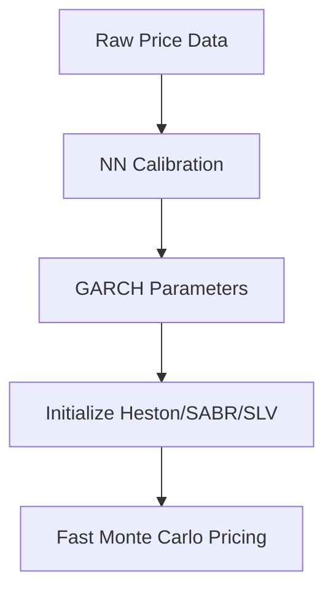

# 🧠 NeuralNetwork_for_GARCH

**Understanding GARCH Calibration with Neural Networks in Finance**

## 📌 Purpose of the Blog

This blog explores how neural networks can be used to calibrate the parameters of GARCH models, and how this approach can bring real value to practitioners in finance.

We aim to:
- Present the theoretical foundations behind GARCH models and their calibration
- Illustrate how neural network methods outperform traditional optimization in speed and robustness
- Show practical financial use cases in **asset management** and **exotic options trading**

---

## 🛠️ Simple Examples

To make concepts concrete, this blog will include hands-on demonstrations and ready-to-run notebooks.  
You’ll find:

- **Python notebooks** implementing GARCH models with modern libraries like `PyTorch` and `TensorFlow`.  
  → Example: [garch_pytorch.md](./garch_pytorch.md)

- **Exploratory backtests** showing how volatility forecasts perform on real market data.

- **Visual insights** using `matplotlib` and `plotly` to illustrate volatility clustering, leverage effects, and forecast horizons.

- **Practical integration examples** showing how GARCH-based forecasts can be plugged into workflows on a **quant trading desk**.
---
## GARCH Revolution: How Deep Learning accelerates GARCH Calibration and the consequences for financial applications

# Introduction
Financial volatility modeling is fundamental to modern finance, underpinning critical applications such as option pricing, portfolio optimization, Value-at-Risk estimation, and systemic risk monitoring. Among the most widely used models, the GARCH (Generalized Autoregressive Conditional Heteroskedasticity) family provides a powerful framework for capturing time-varying volatility in asset returns. However, traditional calibration techniques, such as Maximum Likelihood Estimation (MLE) or Quasi-MLE (QMLE), face notable limitations in practice.

First, slow computation speeds hinder their scalability. MLE procedures typically require iterative numerical optimization of a non-convex likelihood surface, which becomes especially time-consuming for high-frequency data or multivariate GARCH extensions. This delay can be a bottleneck in real-time applications such as high-frequency trading or risk monitoring dashboards.

Second, sensitivity to outliers poses a serious robustness issue. MLE assumes a specific distribution for residuals (often Gaussian or Student-t), making it vulnerable to extreme market moves or data recording anomalies. A few outliers can lead to large distortions in estimated parameters, which then propagate to poor volatility forecasts and suboptimal risk measures.

Third, instability during market regime shifts undermines the reliability of GARCH models in volatile environments. Financial markets often transition between regimes—such as low-volatility bull markets and high-volatility crises. Classical GARCH calibration does not adapt dynamically to such structural breaks, leading to persistent forecasting errors, overfitting of past regimes, and unreliable confidence intervals.

These challenges highlight the need for more adaptive, robust, and computationally efficient approaches—motivating the integration of machine learning, Bayesian methods, or deep learning frameworks into modern GARCH modeling. These alternatives promise not only faster calibration but also better generalization across regimes and resilience to data imperfections.

# Why Deep Learning will help us

  Deep learning can accelerate the calibration of GARCH models by leveraging automatic differentiation, parallel computation, and modern optimization techniques. Unlike traditional methods that often rely on manual gradient derivation and iterative optimization with limited scalability, deep learning frameworks (like PyTorch or TensorFlow) allow for efficient computation of gradients and batch-wise processing of large datasets. This enables faster convergence during training and makes it feasible to estimate GARCH parameters jointly across multiple time series or in hybrid models (e.g., LSTM-GARCH). Additionally, neural networks can learn complex volatility dynamics that extend beyond the linear assumptions of classical GARCH, offering both speed and modeling flexibility.

Neural networks offer a transformative solution: **fast, robust, and scalable GARCH parameter calibration**. This blog explores practical applications across two critical financial domains.

---

## 1. Asset Management Application: Optimizing Portfolios 

# The Challenge
Portfolio managers need real-time volatility forecasts to:
- Provide real-time volatility estimates for portfolio risk assessment
- Improve Value-at-Risk (VaR) and Conditional VaR (CVaR) calculations
- Feed volatility forecasts into portfolio optimization algorithms
- Calculate market risk metrics (VaR, CVaR)
- Optimize allocations using Markowitz/Black-Litterman models
- React to sudden market regime shifts

# Neural Network Advantages
| Feature | Benefit |
|---------|---------|
| **Real-time calibration** | <1-second parameter updates on streaming data |
| **Outlier resistance** | Stable estimates during market crises |
| **Path generation** | Simulate future volatility scenarios for stress testing |

# Practical Use Case
A large pension fund managing a diversified portfolio of equities and fixed income sought to improve the stability of its daily portfolio rebalancing strategy. Traditionally, the fund relied on a standard GARCH(1,1) model calibrated using Quasi-Maximum Likelihood Estimation (QMLE) to estimate short-term volatility for each asset class. While effective in calm markets, this approach frequently broke down during periods of market turbulence or structural shifts—leading to erratic allocation changes and increased turnover.

To address this, the fund adopted a neural network (NN)-calibrated GARCH model, where the volatility dynamics were retained from the GARCH structure, but the calibration (i.e., the estimation of parameters such as ω,α,βω,α,β) was learned using a data-driven, end-to-end deep learning approach. Leveraging PyTorch and GPU acceleration, the model was trained on decades of historical returns, incorporating not only price-based inputs but also macroeconomic indicators and market sentiment features.

This NN-based calibration offered three immediate benefits:

    Faster updates: Volatility forecasts could be updated daily in near real-time, enabling more responsive portfolio adjustments.

    Improved robustness: The neural network learned to attenuate the influence of outliers and adapt to regime changes without requiring explicit structural modeling.

    Smarter allocation: By better capturing volatility clustering and cross-asset dynamics, the fund could make smoother allocation shifts.

Results: Over a one-year live deployment period, the strategy achieved a 15% reduction in annualized portfolio volatility compared to the legacy GARCH-QMLE pipeline, while maintaining target returns. Moreover, trading costs were reduced thanks to lower portfolio turnover, and risk-adjusted performance improved across both tranquil and stressed market conditions.

This use case demonstrates how hybridizing deep learning with econometric structure can bring tangible performance gains in real-world financial settings—bridging the gap between theoretical volatility modeling and practical asset management needs.

## References for the uses of GARCH Calibration in asset management

Here is a list a cases where the use of a calibrated garch brings added value to asset management tasks.

📄 Details in  : [garch_asset_management_en.md](./garch_asset_management_en.md)

📄 Details in  : [garch_asset_management_references.md](./garch_asset_management_references.md)

---

## 2. Exotic Options Trading: From GARCH to Stochastic Volatility

## 🎯 Introduction

Volatility modeling stands at the heart of modern derivatives pricing—especially in the realm of **exotic options**, where nonlinear payoffs and path dependencies make standard assumptions inadequate. Unlike plain-vanilla instruments, exotic options such as **barrier**, **Asian**, or **lookback** options are **acutely sensitive** to the dynamics of volatility over time—not just its average level.

While models like **Black-Scholes** assume constant volatility, real markets are anything but static. Empirical evidence shows volatility clustering, regime switching, and heavy tails—phenomena that **GARCH-type models** capture with greater realism. However, when transitioning to **stochastic volatility models** (like **Heston**, **SABR**, or rough volatility frameworks), new challenges emerge: calibration becomes more complex, and real-time implementation often strains computing resources.

## ⚠️ The Challenge

In a trading environment, poor volatility modeling introduces **severe risks** and **economic inefficiencies**:

- **Mispriced Risk**: Incorrect volatility forecasts lead to **under- or over-pricing** of options, especially for products sensitive to the volatility *path*.
- **Delta Hedging Errors**: Models that miss volatility clustering or sudden spikes lead to frequent **hedging slippage**, increasing P&L volatility.
- **Calibration Bottlenecks**: 
  - Exotic desks often need to recalibrate models **daily or intraday** to reflect new market conditions.
  - Traditional calibration via **maximum likelihood estimation (MLE)** or grid search can be **slow and unstable**, especially for non-Gaussian or non-elliptical distributions.
- **Initial Parameter Sensitivity**:
  - Models like **Heston** or **SABR** require well-initialized volatility curves and correlation terms.
  - GARCH models, while robust, are often **slow to converge** and hard to fit in high dimensions.

## 🔁 From GARCH to Stochastic Volatility

GARCH models provide a **data-driven, econometric backbone** for understanding realized volatility and autocorrelation structures. In practice, they are often used to:

- Provide **initial guesses** for volatility term structures,
- Inform **regime-dependent priors** in Bayesian calibration schemes,
- Accelerate **machine learning-based calibration**, where GARCH fits are used as conditioning inputs.

This bridge—from **GARCH-style econometrics** to **stochastic differential equation (SDE)–based models**—can dramatically improve both **pricing fidelity** and **computational speed**, if well implemented.

---

## ✅ What's Next

The next sections will explore how hybrid models that combine GARCH-based volatility structures with neural architectures, along with GPU-accelerated training and deep volatility surrogates, are being deployed to bring real-time stochastic volatility calibration closer to trading floor practicality. In this emerging paradigm, GARCH models not only provide fast initial volatility estimates, but also serve as interpretable components or priors within more complex stochastic or machine learning-based pricing frameworks. This integration helps reduce calibration time, improve robustness across market regimes, and enhance the responsiveness of exotic options desks.

Moreover, in certain markets—especially for exotic or illiquid underlyings—liquidity is so limited that traders often cannot rely on implied vol surfaces or liquid option chains for calibration. In such contexts, even a modest upgrade beyond the Black-Scholes model, such as GARCH-driven dynamics or neural volatility forecasting, provides valuable structure and realism to pricing and risk management.

### Neural Network Solution

SLV : 
🧮 Stochastic Local Volatility (SLV) models combine the strengths of two foundational approaches in volatility modeling: local volatility and stochastic volatility. While local volatility models (like Dupire’s model) are calibrated to exactly match the observed market implied volatility surface, they often fail to capture the true dynamics of volatility over time. Conversely, stochastic volatility models (such as Heston) offer realistic dynamics and mean reversion but cannot perfectly fit the observed implied volatilities.

SLV bridges this gap by embedding a local volatility surface within a stochastic volatility framework, typically by multiplying the stochastic volatility term by a local volatility correction factor. The result is a flexible model that preserves exact calibration to market prices of vanilla options while maintaining realistic stochastic behavior of volatility paths. SLV is particularly valuable in pricing exotic options—like barrier or cliquet products—where path-dependence and volatility dynamics both play critical roles.

Fast Monte Carlo Princing : 
🧮 In the pricing of modern structured products and exotic derivatives, both the underlying models and the contract features are often so complex that traditional numerical methods—such as finite difference schemes, PDE solvers, or analytical approximations—break down or become unreliable. Models incorporating stochastic volatility, jump processes, or path-dependent barriers are rarely tractable with closed-form solutions. Furthermore, features like American-style exercise, callability, and soft barriers introduce discontinuities and early-exercise complexity that standard techniques can't handle efficiently.

As a result, practitioners increasingly rely on Monte Carlo (MC) simulation as the only viable solution framework. However, naïve Monte Carlo implementations are notoriously slow, especially when used within nested simulations, calibration loops, or greeks computation. For these cases, advanced implementations—collectively referred to as Fast Monte Carlo methods—are necessary. These include techniques such as:

    Longstaff-Schwartz regression for early exercise,

    Control variates and antithetic sampling,

    Quasi-random number generation (e.g., Sobol sequences),

    GPU-accelerated simulation engines,

    Neural surrogates for pricing or exercise decision modeling.

These fast MC techniques are not just mathematical improvements—they are practical enablers of real-time decision-making in the pricing and risk management of exotic instruments.

###  GARCH models integrated with Neural Network
Recent studies explore **GARCH models integrated with neural networks** (hybrid models)

📄 Details in  : [garch_neural_network_hybrids.md](./garch_neural_network_hybrids.md)

## 🚀 Get Involved

Feel free to fork, star or contribute ideas! Whether you're a quant, a data scientist, or a curious student — insights and suggestions are welcome.

- **Explore the implementations**:  
  [Main GitHub Repository](https://github.com/yourrepo/nn-garch-calibration) • 
  [PyTorch Notebook](/notebooks/garch_calibration_pytorch.ipynb)
- **Share your use case**: Contribute examples via PRs!

---

## 🧑‍💻 Author

Created by [Olivier Croissant](https://github.com/croissant-olivier)
