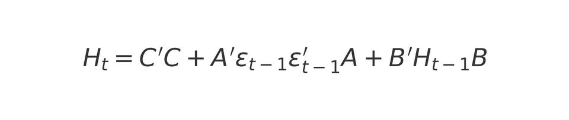

# Reference: Engle & Kroner (1995)

## 📚 Full Title
**Engle, R. F., & Kroner, K. F. (1995)**  
*Multivariate Simultaneous Generalized ARCH*  
Published in _Econometric Theory_, **11(1)**, 122–150.

## 🧠 Context

Engle & Kroner (1995) introduced the **BEKK-GARCH** model (Baba, Engle, Kraft, and Kroner), a multivariate specification of GARCH models designed to model **conditional volatility** and **dynamic correlations** among multiple financial time series.

This model addresses limitations of earlier multivariate GARCH models by ensuring:

- The **positive definiteness** of the conditional covariance matrix,
- A **compact parameter structure** (fewer parameters than VEC-GARCH),
- Better suitability for practical applications (finance, macroeconomics, asset pricing...).

## 🧮 BEKK-GARCH(1,1) Model Formulation

For a vector series of returns \( r_t \) with conditional variance matrix \( H_t \), the BEKK(1,1) model is:



where:
- \( C \) is a triangular matrix (for identification),
- \( A \) captures the effect of **past shocks** (instantaneous volatility),
- \( B \) captures **volatility persistence** over time.

## 💼 Applications in Asset Management

- **Dynamic diversification**: measuring time-varying correlations between asset classes,
- **Portfolio optimization** with multivariate conditional volatility,
- **Pricing of multi-asset options** or structured products involving several underlyings,
- **Systemic risk management** and strategic allocation.

## 🔍 Key Strengths

- Practical for portfolios of moderate size (2 to 5 assets),
- Robust: guarantees \( H_t \) is a valid covariance matrix,
- Standard model in modern empirical applications.

## 📎 BibTeX Reference

```bibtex
@article{engle1995multivariate,
  title={Multivariate Simultaneous Generalized ARCH},
  author={Engle, Robert F and Kroner, Kenneth F},
  journal={Econometric Theory},
  volume={11},
  number={1},
  pages={122--150},
  year={1995},
  publisher={Cambridge University Press}
}
```
